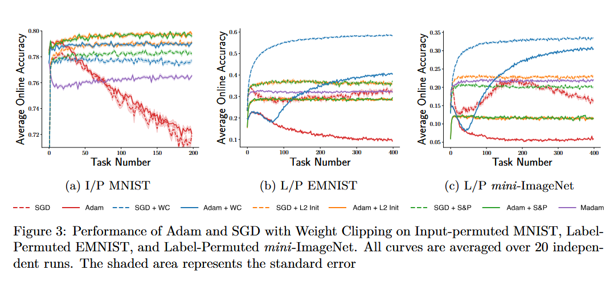

# Weight-Clipping

This project is motivated by below paper.<br>
[Elsayed, M., Lan, Q., Lyle, C., & Mahmood, A. R. (2024). Weight Clipping for Deep Continual and Reinforcement Learning](https://arxiv.org/abs/2407.01704)

## Introduction

Catastrophic forgetting is the phenomenon that manifests as the failure of gradient-based methods (e.g., SGD or Adam) to retain or leverage past knowledge because previously learned units are overwritten (Kirkpatrick et al., 2017).

Loss of plasticity is the phenomenon in which a learner’s ability to acquire new information diminishes. More precisely, units lose their ability to learn when their gradients vanish due to excessively large pre-activation magnitudes.

In this paper, the authors propose **weight clipping**, a method that mitigates *catastrophic forgetting* and *loss of plasticity* simultaneously. I implemented tests on input-permuted MNIST, label-permuted EMNIST, and label-permuted mini-ImageNet. Input-permuted MNIST is a well-known test bed for catastrophic forgetting. In supervised learning with label-permuted datasets, loss of plasticity and catastrophic forgetting are often intertwined (Elsayed, M., Lan, Q., Lyle, C., & Mahmood, A. R., 2024).

- **input-permuted**: randomizing the order of input dimensions (e.g., for a sample (1, 2, 3, 4, 5) → (5, 4, 2, 1, 3))
- **label-permuted**: randomizing the mapping from inputs to labels

## Experimental Objectives

In this project, I had two objectives:

1. Observe *catastrophic forgetting* and *loss of plasticity* by training neural networks myself.
2. Implement the weight clipping method and evaluate whether it mitigates *catastrophic forgetting* and *loss of plasticity*.

## Weight Clip in code

I chose to implement **weight clipping** exactly as described in the paper.

```python
@T.no_grad()
def __weight_clipping(
    self,
) -> None:

    for param in self.param_groups[0]["params"]:
        if param.ndim == 2:
            fan_in = param.shape[1]
        param.copy_(
            T.clip(
                param,
                -self.k / ma.sqrt(fan_in),
                self.k / ma.sqrt(fan_in),
            )
        )
```
*./optimizer.py*<br><br>

## Input and Label Permutation in code

I implemented a permutation class so that, every `permutation_interval` steps, the data loader permutes the pixel order of the images. Moreover, incrementing `num_step` each time this class is called is appropriate, because in a continual-learning setting the number of updates equals the number of loaded samples.

```python
class Permutation:
    def __init__(
        self,
        permute_size: int,
        permute_interval: int,
    ):

        self.permute_size = permute_size
        self.__reset_permutation()

        self.num_step = 0
        self.permute_interval = permute_interval

    def __call__(
        self,
        x: T.tensor,  # 1d tensor
    ):


        self.num_step += 1
        permuted_x = x[self.permutation_idx]

        if self.num_step % self.permute_interval == 0:
            self.__reset_permutation()

        return permuted_x

    def __reset_permutation(
        self,
    ):
        self.permutation_idx = T.randperm(self.permute_size)
```
*./data_loader.py*<br><br>

```python
        self.permutation = Permutation(
            permute_size=self.n_inputs,
            permute_interval=permute_interval,
        )

        transform = transforms.Compose(
            [
                *self.transform_order,
                self.permutation,
            ]
        )
```
*./data_loader.py*<br><br>

## Experiments

*What I get from my own experiments*
|Input-permuted MNIST                               |Label-permuted EMNIST                                |Label-permuted mini-ImageNet   |
:--------------------------------------------------:|:---------------------------------------------------:|:-----------------------------:|
||||

*results from the paper*<br>


* Input-permuted MNIST
    * I tested from task 400 tasks (step = 200(the number of tasks) * 5000(permutation interval))
    * As it shows, SGD and Adam showed consistent dropping as task changes. However, their decreasing is slow compared to the result in the paper.

* Label-permuted EMNIST
    * I tested from task 200 tasks (step = 200(the number of tasks) * 2500(permutation interval))

* Label-permuted mini-ImageNet
    * I tested from task 200 tasks (step = 200(the number of tasks) * 2500(permutation interval))
